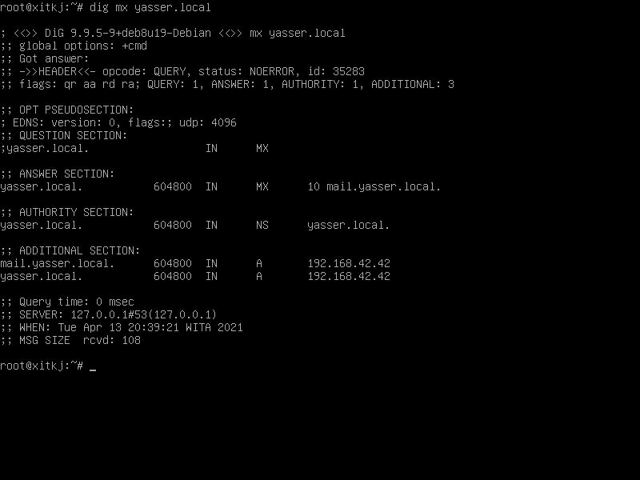
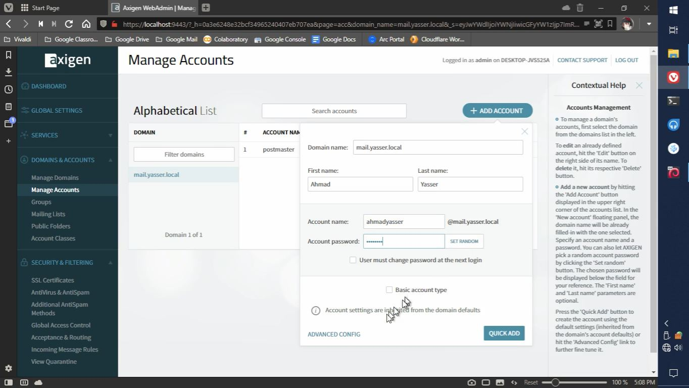

---
categories:
  - tugas
  - tutorial
comment:
date: 2021-04-13T17:51:58+08:00
description:
hidden: false
image: thumbnail.jpg
math:
slug: axigen-mail-server-windows-10
tags:
  - windows 10
title: Menginstall Axigen Mail Server di Windows 10
---

Axigen adalah server email Linux, Windows, dan Docker dengan fungsionalitas groupware dan kolaborasi. Axigen mendukung layanan SMTP, IMAP, POP3, dan webmail, dan juga mencakup fitur seperti server mail terintegrasi, integrasi Antivirus dan Antispam, dan berbagai fungsionalitas mobile termasuk mobile-friendly webmail dan dukungan Exchange ActiveSync. Axigen dapat dihosting di data center, di bare-metal atau Private dan Public Clouds pilihan. [Wikipedia](https://en.wikipedia.org/wiki/Axigen)

Ada 3 versi Axigen yang bisa dipilih, yaitu versi [Business](https://www.axigen.com/mail-server/business/), versi [MSP](https://www.axigen.com/mail-server/msp/), dan versi [ISP](https://www.axigen.com/mail-server/isp/) yang masing-masing memiliki fitur yang berbeda-beda, bisa dicek pada link yang berada pada versinya. Karena ini hanya tutorial, jadi saya hanya "mencoba" agar tidak perlu mengeluarkan uang.

Pertama-tama yang harus dilakukan adalah mendownload executable untuk menginstall Axigen (Installer-nya). Silahkan download [disini](https://www.axigen.com/mail-server/download/), pilih sesuai dengan sistem operasi atau peralatan virtual yang akan digunakan untuk menginstall Axigen (Disini saya memilih Windows). Jika kalian tidak memilih versi Windows maka kalian harus bisa berimprovisasi dengan tahap-tahap selanjutnya karena saya hanya mencontohkan untuk versi Windows, jika tidak bisa silahkan cari tutorial lain saja.

Kalau sudah selesai mendownload, selanjutnya klik kanan pada executable-nya lalu klik `Install`, pastikan kalian menggunakan akun yang memiliki akses administrator (Run as administrator).

Setelah ini akan ada dialog Run as administrator, pilih Yes. Silahkan tunggu beberapa saat (Saya menunggu sekitar 2 menit~).

Tunggu sebentar, browser akan terbuka dan secara otomatis memasuki halaman web untuk konfigurasi Axigen. Jika tidak terbuka juga, silahkan buka browser secara manual dan masukan URL https://localhost:9443.

Kalau ada error seperti diatas dan kalian menggunakan browser berbasis chromium, klik pada `Advanced` lalu klik lagi `Proceed to localhost (unsafe)`, jika tidak silahkan berimprovisasi.

Buat password untuk akun admin, minimal 8 karakter. Klik `Continue` jika sudah selesai.

Konfigurasi yang ini saya "skip", ~~pakai lisensi gratis bisa sih tapi saya males~~. Perlu diingat bahwa jika konfigurasi ini "diskip" maka instalasi Axigen kalian akan diblock (tidak bisa dipakai) dalam kurun waktu 3 hari.

Klik `Continue`.

Karena saya hanya "mencoba", disini saya menggunakan domain yang sebelumnya sudah saya buat pada Debian 8 DNS Server yang berada di VirtualBox.

Postmaster Account Password isi dengan password untuk akun postmaster.

Klik finish. Lalu pada kolom URL di browser, hapus sebagian URL sisakan https://localhost:9443, bisa juga kalau menggunakan https://nama-domain:9443.

Login sebagai admin dengan cara memasukkan `admin` sebagai username dan password yang tadi dibuat (yang pertama).

Klik pada `Domains & Accounts` agar "ter-expand" lalu klik `Manage Accounts`.

Klik `Add Account`.

Isi seperti diatas, sesuaikan dengan akun yang ingin kalian buat. Klik `Quick Add` untuk menambah akun.

Selanjutnya tambah akun lagi agar bisa melakukan ujicoba, klik `Add Account`.

Klik `Quick Add` lagi.

Setelah itu buat tab baru pada browser, masukkan https://localhost atau https://nama-domain pada kolom URL. Akan muncul kembali error seperti sebelumnya, cara mengatasi-nya sama saja.

Isi username dengan akun yang tadi dibuat, lalu password dengan password-nya. Klik `Login`. Tunggu sebentar (Akan ada loading).

Klik `New` yang berada pada pojok kiri atas untuk membuat email.

Kolom `to:` diisi dengan akun yang lain (untuk menerima email), kolom ke-3 `subject` isi dengan judul email, lalu kolom paling bawah diisi dengan isi email, kolom `cc:` digunakan untuk mengirim "copy" dari mail ini kepada penerima yang lain, jadi kolom `cc:` ini diisi dengan akun penerima yang lain jika kita ingin mengirimkan email ini kepada banyak penerima sekaligus, karena saya hanya membuat 1 akun tambahan saja jadi saya kosongkan saja disini.

Klik tombol seperti diatas untuk mengirim email, bisa juga dengan cara klik <kbd>CTRL + ENTER</kbd> pada keyboard.

Klik pada `Sent`, seharusnya muncul email yang dikirim tadi. Kalau tidak muncul coba klik pada `Check Email` yang berada dibawah `New`, kalau tidak muncul juga berarti ada kesalahan pada konfigurasi yang dilakukan sebelumnya.

Selanjutnya cek email yang diterima oleh akun yang lain.

Klik ikon gir yang berada dikiri bawah lalu klik `Log out`.

Masukkan akun penerima email beserta password-nya.

Setelah itu balas email tersebut.

Lakukan sama seperti tadi, tapi biarkan kolom `to:` dan kolom ke-3 `subject`.

Cek email terkirim seperti tadi.

Log out juga seperti tadi untuk mengecek email yang diterima oleh akun yang tadi.

Login dengan menggunakan akun yang pertama.

Jika email diterima maka bisa dikatakan instalasi Axigen Mail Server sudah sukses.
