---
categories:
  - tutorial
comment:
date: 2021-02-19T09:41:53+08:00
description: 
hidden: false
image: thumbnail.jpg
keywords:
  - Konfigurasi DNS Server Bind9 Debian 8
  - Konfigurasi DNS Server Bind9 Debian 8 VirtualBox
  - Cara mengkonfigurasi DNS Server Bind9 Debian 8
  - Cara mengkonfigurasi DNS Server Bind9 Debian 8 VirtualBox
  - Instalasi DNS Server Bind9 Debian 8
  - Instalasi DNS Server Bind9 Debian 8 VirtualBox
  - Cara menginstall DNS Server Bind9 Debian 8
  - Cara menginstall DNS Server di Debian 8 VirtualBox
  - Konfigurasi DNS Server di Debian 8
  - Konfigurasi DNS Server di Debian 8 VirtualBox
  - Cara mengkonfigurasi DNS Server di Debian 8
  - Cara mengkonfigurasi DNS Server di Debian 8 VirtualBox
  - Instalasi DNS Server di Debian 8
  - Instalasi DNS Server di Debian 8 VirtualBox
  - Cara menginstall DNS Server di Debian 8
  - Cara menginstall DNS Server di Debian 8 VirtualBox
math:
slug: debian-8-dns-server-bind9
tags:
  - administrasi sistem jaringan
  - debian 8
  - virtualbox
title: Konfigurasi DNS Server Bind9 Debian 8 VirtualBox
---



> Sebelum eksekusi, pastikan kalian sudah:
> - [x] [Menginstall Debian 8 di VirtualBox](/p/install-debian-8-virtualbox/)
> - [x] Menclone Debian 8]
> - [x] Memiliki koneksi internet
> - [x] Mengkonfigurasi network pada Debian 8 (Bridged)
> - [x] Login sebagai root

#### 1. Update repository `apt update`

#### 2. Install Bind9 `apt install bind9`

Tekan enter saat ada konfirmasi `Do you want to continue?  [Y/n]`.

#### 3. Pindah ke direktori konfigurasi Bind9 `cd /etc/bind9`

#### 4. Cek IP `ip a s eth0`

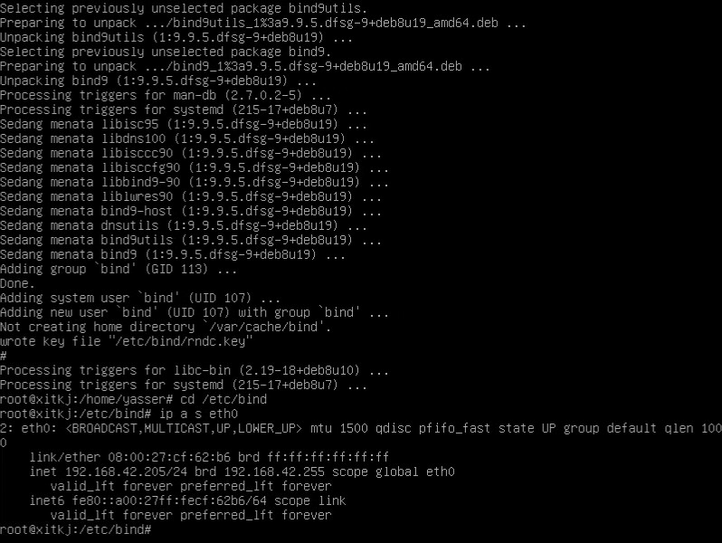

#### 5. Konfigurasi Bind9 (`named.conf.default-zones`)

```
nano named.conf.default-zones
```

Tambahkan konfigurasi ini dibagian paling bawah

```
zone "yasser.local" {
    type master;
    file "/etc/bind/db.yasser.local";
};

zone "42.168.192.in-addr.arpa" {
    type master;
    file "/etc/bind/db.192";
};
```

> - Selalu ubah `yasser.local` menjadi nama domain yang ingin kalian gunakan
> - Ubah `42.168.192` menjadi kebalikan dari IP kalian, IP saya `192.168.42.205` maka disana dimasukkan `42.168.192`.

#### 6. Konfigurasi Bind9 (db)

Copy dulu db-nya.

```
cp db.local db.yasser.local
cp db.127 db.192
```

Setelah itu ubah domain-nya.

```
sed -i 's/localhost/yasser.local/g' db.yasser.local
sed -i 's/localhost/yasser.local/g' db.192
```

Lalu edit.

```
nano db.yasser.local
```

 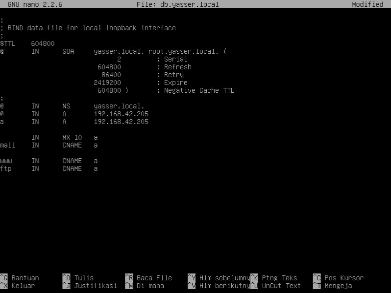

Ubah `192.168.42.205` menjadi IP kalian.

```
nano db.192
```

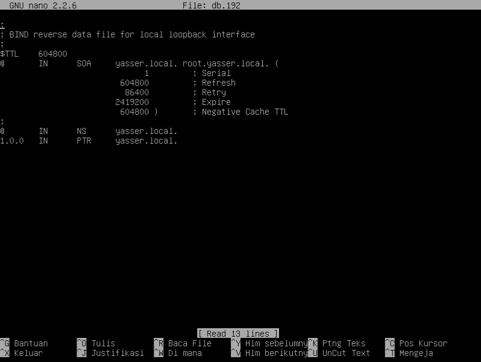 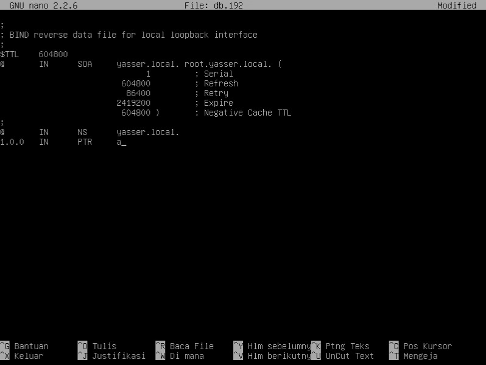

#### 7. Restart layanan Bind9 `/etc/init.d/bind9 restart`

#### 8. Konfigurasi DNS Server yang digunakan

```
nano /etc/resolve.conf
```

Lalu tambahkan IP kalian dibagian paling atas.

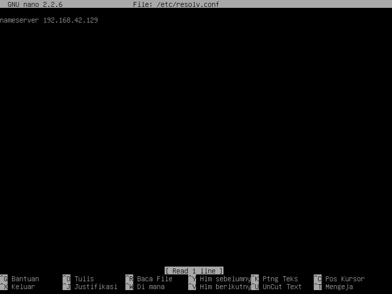 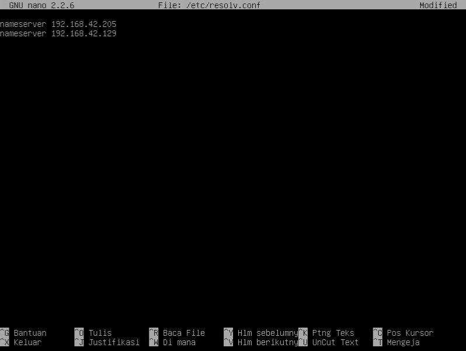

#### 9. Ujicoba konfigurasi Bind9

Jalankan perintah dibawah, jika tidak error maka konfigurasi Bind9 sudah benar.

```
dig yasser.local
nslookup yasser.local
ping yasser.local
```

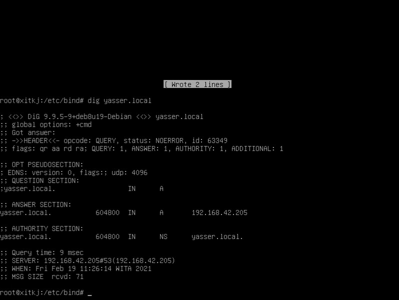

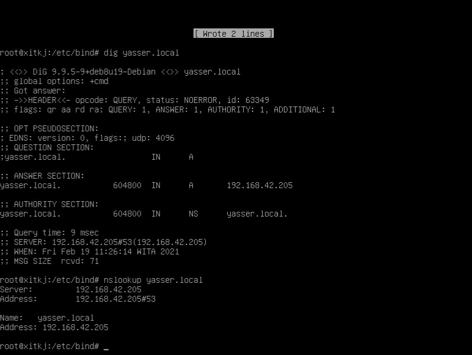

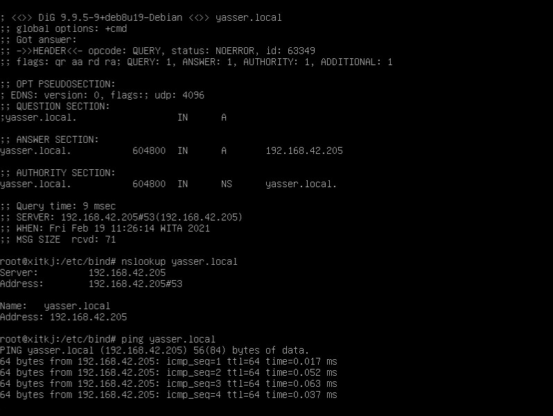

Setelah itu ujicoba pada Windows 10. Pergi ke konfigurasi adapter lalu klik kanan pada network yang dibridge pada VirtualBox lalu klik Status.

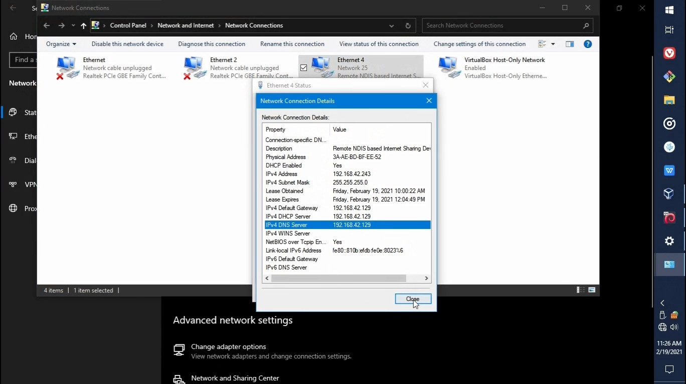

DNS Server saya `192.168.42.129`.


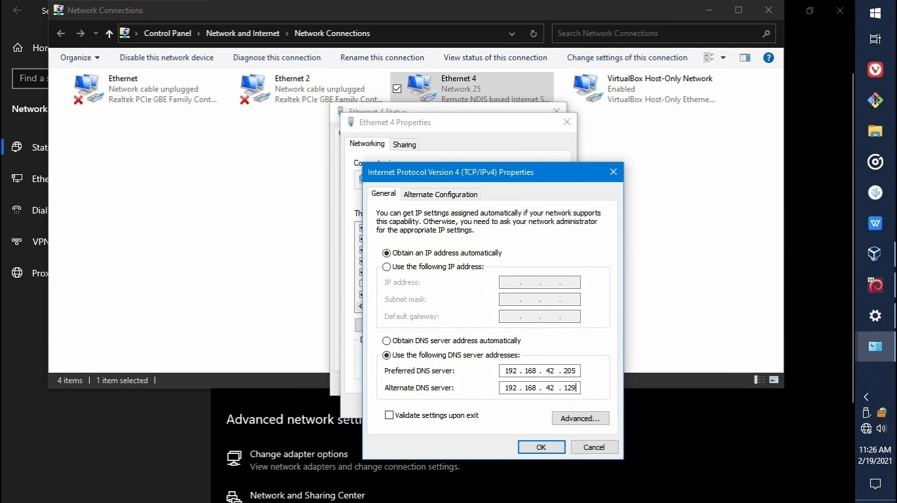

Setelah itu buka Run lalu isi dengan `ping yasser.local -t`.

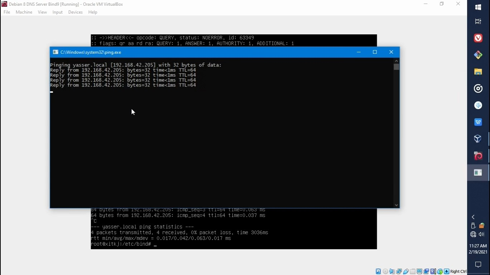

> - Kalau ada kesalahan tolong beri tahu melalui komentar
> - Kalau kurang jelas atau kurang paham silahkan tanyakan melalui komentar

#### [Thumbnail image source](https://www.zerochan.net/1533595)