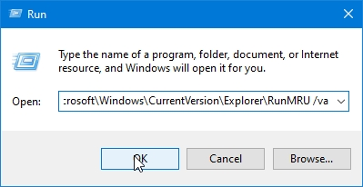

---
categories:
  - tutorial
comment:
date: 2021-02-17T18:37:57+08:00
description: 
hidden: false
image: thumbnail.jpg
math:
slug: hapus-history-run
tags:
  - windows 10
title: Menghapus History Run
---

- [1. Buka Run](#1-buka-run)
- [2. Masukkan Command](#2-masukkan-command)
- [3. Cara yang lebih mudah](#3-cara-yang-lebih-mudah)
- [Thumbnail image source](#thumbnail-image-source)

#### 1. Buka Run

Bisa klik `Windows + R` atau klik kanan pada logo Windows lalu pilih Run.

#### 2. Masukkan Command

Commandnya:

```
reg delete HKEY_CURRENT_USER\Software\Microsoft\Windows\CurrentVersion\Explorer\RunMRU /va
```




#### 3. Cara yang lebih mudah

Caranya cukup download script [ini](https://drive.google.com/file/d/1fwVSikJJk3MxHdGB6khvdbABhW7Hyy_a/view?usp=sharing) lalu jalankan saja script-nya jika ingin menghapus history Run.

#### [Thumbnail image source](https://www.zerochan.net/2535972)