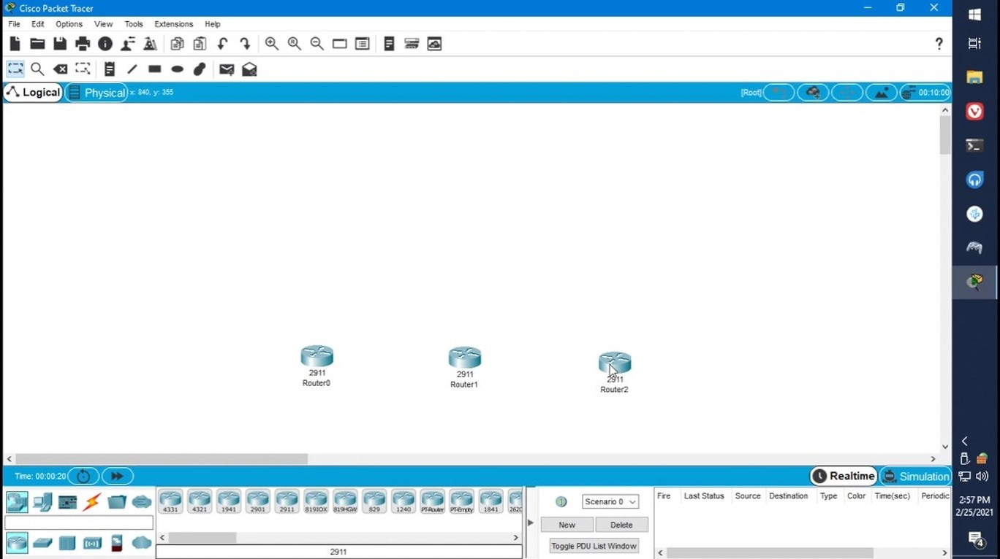

---
categories:
  - tugas
  - tutorial
comment:
date: 2021-02-25T15:11:57+08:00
description:
hidden: false
image: thumbnail.jpg
keywords:
  - Routing OSPF
  - Konfigurasi Routing OSPF
  - Konfigurasi Routing OSPF di Cisco Packet Tracer
  - Cara Konfigurasi Routing OSPF
  - Cara Konfigurasi Routing OSPF di Cisco Packet Tracer
  - Langkah-langkah Konfigurasi Routing OSPF
  - Langkah-langkah Konfigurasi Routing OSPF di Cisco Packet Tracer
math:
slug: packet-tracer-ospf
tags:
  - administrasi infrastruktur jaringan
  - cisco packet tracer
title: Konfigurasi Routing OSPF di Cisco Packet Tracer
---



#### 1. Masukkan 3 buah router

#### 2. Masukkan 1 buah PC diatas tiap router

#### 3. Hubungkan semua router

Kabel yang digunakan adalah kabel 'Copper Cross-Over', urutan menghubungkannya:

| No  | Port yang dihubungkan                                        |
| --- | ------------------------------------------------------------ |
| 1   | GigabitEthernet0/0 Router0 dengan GigabitEthernet0/0 Router1 |
| 2   | GigabitEthernet0/1 Router1 dengan GigabitEthernet0/0 Router2 |

#### 4. Hubungkan PC dengan router yang berada dibawahnya

Kabel yang digunakan adalah kabel 'Copper Straight-Through', hubungkan FastEthernet0 pada PC dengan GigabitEthernet router yang paling atas.

#### 5. Beri keterangan Network

#### 6. Konfigurasi Router0

Selanjutnya ubah IP dari PC yang berada diatas Router0 (PC0).

Jika sudah ujicoba konfigurasinya dengan mengirim packet, klik `P` di keyboard lalu klik pada Router0 dan PC0.

Jangan lupa klik delete setiap selesai mengujicoba agar mudah melihat hasil-nya.

Setelah itu konfigurasi juga router lainnya, berikut perbandingan konfigurasinya dengan Router0:

| Jenis                                             | Router0     | Router1     | Router2     |
| ------------------------------------------------- | ----------- | ----------- | ----------- |
| [Hostname](image006.jpg)                          | Router0     | Router1     | Router2     |
| [GigabitEthernet0/0 - IPv4 Address](image007.jpg) | 1.1.1.1     | 1.1.1.2     | 2.2.2.2     |
| [GigabitEthernet0/1 - IPv4 Address](image008.jpg) | 192.168.1.1 | 2.2.2.1     | 192.168.3.1 |
| GigabitEthernet0/2 - IPv4 Address                 | Tidak ada   | 192.168.2.1 | Tidak ada   |
| [IPv4 Address PC](image009.jpg)                   | 192.168.1.2 | 192.168.2.2 | 192.168.3.2 |
| [Default Gateway PC](image009.jpg)                | 192.168.1.1 | 192.168.2.1 | 192.168.3.1 |

Lakukan ujicoba yang sama juga pada router lain.

#### 7. Konfigurasi routing OSPF pada tiap router

Saya merekomendasikan urutan mengkonfigurasinya Router0 > Router2 > Router1 karena nanti ada loading saat routernya melakukan routing. Jadi jika Router1 yang dikonfigurasikan terakhir, menunggu loadingnya di satu tempat saja.

Klik dua kali pada router yang ingin dikonfigurasi, pilih tab CLI, lalu.

> Network yang dimaksud pada tahap ke-2 adalah network yang terhubung dengan router.
>
> - Router0: 192.168.1.0, 1.1.1.0
> - Router1: 192.168.2.0, 1.1.1.0, 2.2.2.0
> - Router2: 192.168.3.0, 2.2.2.0
>
> Wildcard mask pada tahap ke-2 disesuaikan dengan IP range dari networknya,
>
> - Jika x.x.x.x/30 maka isi dengan 0.0.0.3
> - Jika x.x.x.x/24 maka isi dengan 0.0.0.255
>
> Lakukan tahap ke-2 sebanyak network yang terhubung pada routernya.

Jika sudah selesai masuk pada tab CLI Router1 lalu tunggu hingga ada output seperti dibawah.

#### 8. Cek konfigurasi OSPF

Masih di Router1, ketik `end` untuk keluar dari mode konfigurasi.

Jika hasilnya seperti diatas maka konfigurasinya sudah benar.

#### 9. Ujicoba konfigurasi OSPF

Ujicobanya cukup kirim paket secara acak saja, jika tidak ada failed maka OSPF routing sudah bekerja dengan baik.

#### [Thumbnail image source](https://www.zerochan.net/633987)
